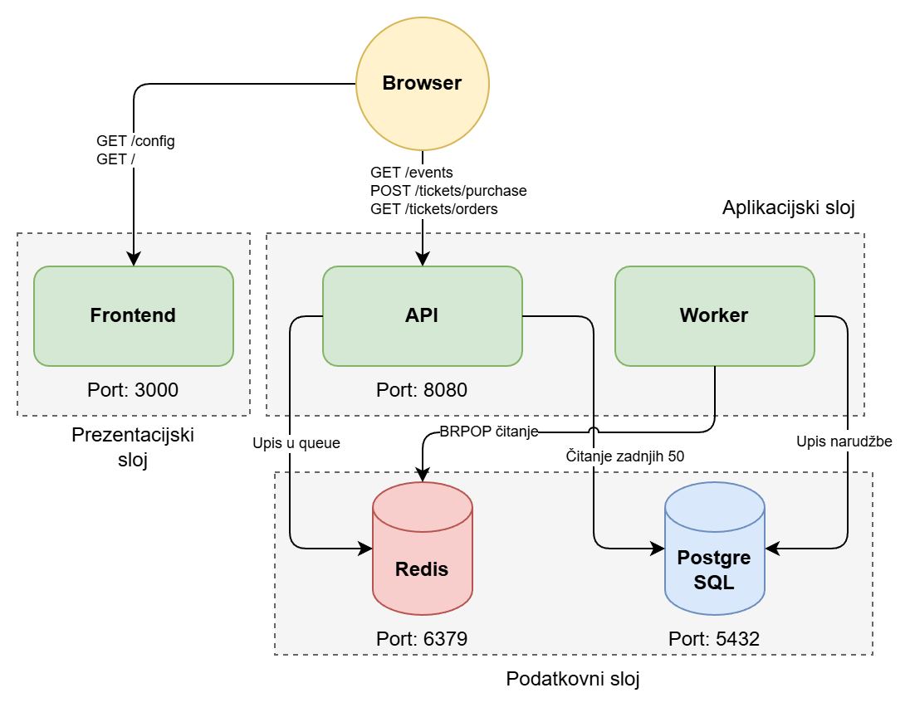
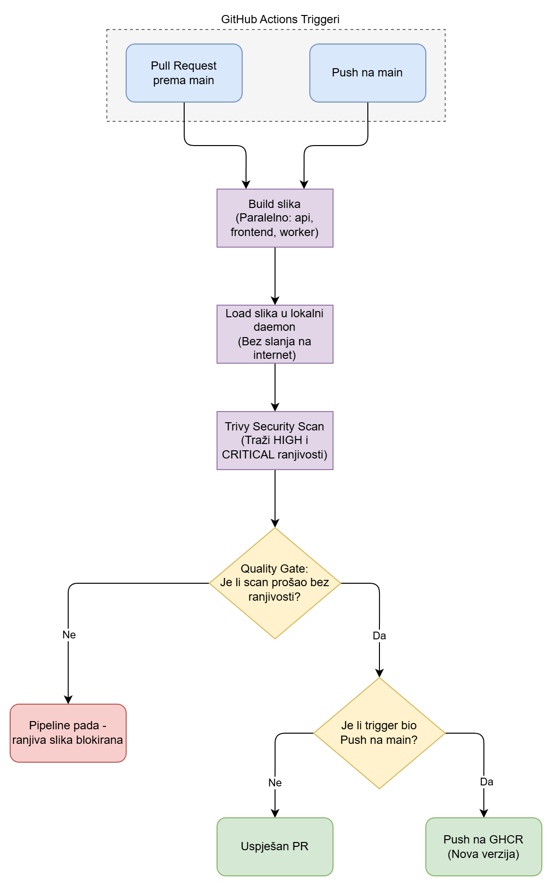

# Secure Event Ticketing Platform

Ovaj repozitorij je namijenjen demonstraciji rješenja projektnog zadatka za kolegij **Uvod u DevOps - DevSecOps**.

Platforma demonstrira cjeloviti DevSecOps tok jedne višeslojne aplikacije: od lokalnog razvoja kroz Podman/Docker Compose, preko produkcijskog deploymenta na Kubernetes/OpenShift, do CI/CD pipeline-a s integriranim sigurnosnim skeniranjem (Trivy quality gate).

---

## Sadržaj

1. [Pregled aplikacije i arhitekture](#pregled-aplikacije-i-arhitekture)
2. [Struktura repozitorija](#struktura-repozitorija)
3. [Brzi početak (TL;DR)](#brzi-početak-tldr)
4. [Dio 1 - Lokalni razvoj (Compose)](#dio-1---lokalni-razvoj-compose)
5. [Dio 2 - Kubernetes deployment](#dio-2---kubernetes-deployment)
6. [Dio 3 - CI/CD pipeline](#dio-3---cicd-pipeline)
7. [DevSecOps kontrole](#devsecops-kontrole)
8. [API referenca](#api-referenca)
9. [Troubleshooting](#troubleshooting)
10. [Akademska napomena](#akademska-napomena)
11. [Napomena o umjetnoj inteligenciji](#napomena-o-umjetnoj-inteligenciji)

---

## Pregled aplikacije i arhitekture

### Što aplikacija radi

Jednostavna platforma za prodaju ulaznica za evente. Korisnik kroz preglednik odabire event, šalje narudžbu, narudžba ulazi u Redis queue, a pozadinski worker ju asinkrono upisuje u PostgreSQL. Svi servisi imaju liveness i readiness sonde, non-root korisnika i odvojene konfiguracijske/tajne objekte.

### Servisi

| Servis     | Tehnologija          | Port  | Uloga                                                         |
|------------|----------------------|-------|---------------------------------------------------------------|
| `frontend` | Node.js / Express    | 3000  | Statički web UI (HTML+JS), proxy konfiguracije API URL-a      |
| `api`      | Node.js / Express    | 8080  | REST API: eventi, narudžbe, health/ready sonde                |
| `worker`   | Node.js              | -     | Pozadinska obrada - `BRPOP` iz Redisa, upis u Postgres        |
| `postgres` | PostgreSQL 16-alpine | 5432  | Trajna pohrana narudžbi (`ticket_orders`)                     |
| `redis`    | Redis 7-alpine       | 6379  | Queue narudžbi (`ticket_orders` lista)                        |

### Tok podataka



### Tok jedne narudžbe

1. Preglednik dohvaća `GET /config` od frontenda → dobiva `apiBaseUrl`
2. Preglednik radi `GET {apiBaseUrl}/events` → API vraća popis evenata
3. Korisnik klikne "Purchase" → `POST {apiBaseUrl}/tickets/purchase`
4. API stavlja narudžbu na Redis listu i vraća `202 Accepted`
5. Worker u beskonačnoj petlji radi `BRPOP` na listi i upisuje narudžbu u Postgres
6. Korisnik klikom dohvaća `GET {apiBaseUrl}/tickets/orders` → API čita zadnjih 50 iz baze

---

## Struktura repozitorija

```
devops-project-app/
├── README.md                       # ovaj dokument
├── compose.yaml                    # Dio 1: lokalni dev stack
├── .env.example                    # primjer env varijabli (kopirati u .env)
├── .gitignore                      # ignorira .env i node_modules
│
├── api/                            # REST API servis
│   ├── Containerfile               # multi-stage (prod-deps / dev / production)
│   ├── package.json
│   └── src/server.js
├── frontend/                       # web UI servis
│   ├── Containerfile
│   ├── package.json
│   └── src/
│       ├── server.js
│       └── public/index.html
├── worker/                         # background processor
│   ├── Containerfile
│   ├── package.json
│   └── src/worker.js
│
├── docs/
│   └── diagrams/
│       ├── diagram1.png            # tok podataka između servisa
│       └── diagram2.png            # koraci CI/CD pipeline-a
│
├── infra/
│   └── postgres/init.sql           # inicijalni DB schema (također u ConfigMap-u)
│
├── k8s/                            # Dio 2: Kubernetes manifesti
│   ├── namespace.yaml
│   ├── configmap.yaml              # app config + postgres init.sql
│   ├── secret.yaml                 # POSTGRES_PASSWORD (placeholder, base64)
│   ├── rbac.yaml                   # ServiceAccounti (least-privilege)
│   ├── postgres-pvc.yaml           # PVC 1 GiB
│   ├── postgres.yaml               # Deployment + Service
│   ├── redis.yaml                  # Deployment + Service
│   ├── api.yaml                    # Deployment (2 replice) + Service
│   ├── worker.yaml                 # Deployment (1 replika)
│   ├── frontend.yaml               # Deployment (2 replice) + Service
│   ├── ingress.yaml                # nginx Ingress + OpenShift Route komentar
│   ├── networkpolicy.yaml          # default-deny + 6 granularnih politika
│   └── runbook.md                  # operativni runbook za incidente
│
└── .github/
    └── workflows/
        └── ci.yml                  # Dio 3: build → Trivy scan → push na GHCR
```

---

## Brzi početak (TL;DR)

Ako želiš samo vidjeti aplikaciju kako radi, lokalno:

```bash
git clone https://github.com/krebor/devops-project-app.git
cd devops-project-app

cp .env.example .env
podman compose up --build      # ili: docker compose up --build
```

Otvori `http://localhost:3000` u pregledniku. Detalji u [Dio 1](#dio-1---lokalni-razvoj-compose).

---

## Dio 1 - Lokalni razvoj (Compose)

### Preduvjeti

| Alat                                          | Verzija            | Napomena                                              |
|-----------------------------------------------|--------------------|-------------------------------------------------------|
| [Podman](https://podman.io/) ili Docker       | bilo koja nedavna  | Compose podrška obavezna (`podman compose` / `docker compose`) |
| `git`                                         | 2.x                | Za clone repozitorija                                 |
| Slobodni portovi `3000` i `8080` na hostu     | -                 | Mogu se prepisati kroz `.env` (`API_PORT`, `FRONTEND_PORT`) |

> **Napomena za Podman:** `compose.yaml` koristi puni image registry prefix (`docker.io/library/postgres:16-alpine`) jer Podman po defaultu nema konfiguriran `unqualified-search-registries`. Ako koristiš Docker, kratka imena također rade.

### Setup (samo prvi put)

```bash
# 1. Klonaj repozitorij
git clone https://github.com/krebor/devops-project-app.git
cd devops-project-app

# 2. Kreiraj lokalni .env iz template-a
cp .env.example .env

# 3. (opcionalno) Promijeni POSTGRES_PASSWORD u .env za vlastitu lozinku
```

> `.env` je u `.gitignore` - nikad ga ne commitaj. Sve produkcijske tajne idu u Kubernetes `Secret` objekte (vidi Dio 2).

### Pokretanje stack-a

```bash
# Build i pokretanje u prednjem planu
podman compose up --build

# Ili u pozadini (detached)
podman compose up --build -d

# Pratiti logove kad je u pozadini
podman compose logs -f
```

Stack je spreman kad u logovima vidiš:

```
api       | API listening on port 8080
frontend  | Frontend listening on port 3000
worker    | Worker started and waiting for jobs...
```

Postgres i Redis imaju definirane `healthcheck` blokove, a `api`, `worker` i `frontend` imaju `depends_on: condition: service_healthy` - Compose tek nakon zelenih health checkova pokreće aplikacijske servise.

### Hot-reload tijekom razvoja

Build koristi `target: dev` stage iz svakog `Containerfile`-a, koji pokreće `nodemon`. Promjene u `api/src/`, `frontend/src/` ili `worker/src/` **automatski restartaju** odgovarajući kontejner - nema potrebe za ponovnim buildom slike. Volume mountovi u `compose.yaml` osiguravaju da se izvor mountira direktno u kontejner.

### Validacija

Otvori u pregledniku: **http://localhost:3000** (treba se vidjeti web UI s listom evenata).

Kroz `curl`:

```bash
# Liveness API-ja
curl -s http://localhost:8080/healthz
# → {"status":"ok","service":"api"}

# Readiness (testira Postgres + Redis konekcije)
curl -s http://localhost:8080/readyz
# → {"status":"ready"}

# Lista evenata
curl -s http://localhost:8080/events | head

# Kreiranje narudžbe
curl -s -X POST http://localhost:8080/tickets/purchase \
  -H "Content-Type: application/json" \
  -d '{"eventId":"evt-1001","customerEmail":"student@example.com","quantity":2}'
# → {"message":"Order queued","orderId":"<uuid>"}

# Provjera obrađenih narudžbi (worker upisuje u bazu)
curl -s http://localhost:8080/tickets/orders | head
```

### Zaustavljanje

```bash
# Zaustavi i ukloni kontejnere - volume s podacima ostaje sačuvan
podman compose down

# Zaustavi i obriši sve uključujući volumes (briše podatke baze!)
podman compose down -v
```

### Build production slike (bez Compose-a)

Ako želiš vidjeti finalnu (slim) production sliku iste kao što ide u registry:

```bash
podman build -t ticketing-api:local --target production -f api/Containerfile api/
podman run --rm -p 8080:8080 --env-file .env ticketing-api:local
```

Slika ne sadrži `devDependencies` (`nodemon` nije unutra), pokreće se kao non-root korisnik `app` (UID 1001) i koristi minimalan `node:22-alpine` base.

---

## Dio 2 - Kubernetes deployment

### Preduvjeti

| Alat        | Napomena                                                                |
|-------------|-------------------------------------------------------------------------|
| `kubectl`   | Konfiguriran i spojen na klaster                                        |
| Kubernetes klaster | bilo koja od opcija ispod                                        |
| Container slike u registriju | Default je GHCR (vidi Dio 3); za potpuno offline scenarij vidi `Build slika za lokalni klaster` |

**Opcije za Kubernetes klaster:**

- **Lokalno na WSL2 (preporučeno):** [k3s](https://k3s.io/) - jednostavna instalacija, ingress controller (Traefik) već unutra
- **Lokalno bez WSL2:** [kind](https://kind.sigs.k8s.io/) ili [minikube](https://minikube.sigs.k8s.io/)
- **Cloud:** GKE, AKS, EKS - manifesti rade bez izmjena
- **OpenShift:** Treba dodatno koristiti `Route` umjesto `Ingress` (vidi sekciju ispod)

> **Važno za k3s:** k3s koristi Flannel CNI koji ne podržava `NetworkPolicy`. Manifesti se primijene bez greške, ali pravila se neće primjenjivati. Za pravo testiranje NetworkPolicy potreban je Calico ili Cilium CNI.

### Build slika za lokalni klaster (opcionalno)

Po defaultu Kubernetes manifesti referenciraju slike iz GHCR-a:

```
ghcr.io/krebor/devops-project-app-api:latest
ghcr.io/krebor/devops-project-app-frontend:latest
ghcr.io/krebor/devops-project-app-worker:latest
```

Ako želiš deployati lokalno bez pulla iz registry-ja, build-aj slike i load-aj ih u klaster:

```bash
# Build (production stage)
for svc in api frontend worker; do
  podman build -t ghcr.io/krebor/devops-project-app-$svc:latest \
    --target production -f $svc/Containerfile $svc/
done

# Load u kind klaster (primjer)
kind load docker-image ghcr.io/krebor/devops-project-app-api:latest
# Za k3s: koristi `k3s ctr images import` nakon `podman save`
```

### Priprema prije prvog deployanja

#### 1. Postavi pravu lozinku u `Secret`

Defaultna vrijednost `POSTGRES_PASSWORD` u `k8s/secret.yaml` je placeholder (`change_me_prod`, base64 enkodirano). Generiraj novu vrijednost:

```bash
echo -n "MOJA_PRAVA_LOZINKA" | base64
# zalijepi rezultat u k8s/secret.yaml umjesto postojeće Y2hhbmdlX21lX3Byb2Q= vrijednosti
```

> Za produkciju ne commitaj `secret.yaml` s pravim vrijednostima. Razmotri `Sealed Secrets`, `External Secrets Operator` ili HashiCorp Vault.

#### 2. Postavi hostname za Ingress

`k8s/ingress.yaml` koristi hostname `ticketing.local`. Promijeni ga prema postavkama svog klastera, ili dodaj redak u `/etc/hosts` na lokalnoj mašini:

```bash
# Za k3s na WSL2 (Ingress sluša na 127.0.0.1)
echo "127.0.0.1 ticketing.local" | sudo tee -a /etc/hosts

# Za drugi klaster - saznaj IP Ingress LB-a
kubectl get svc -n ingress-nginx ingress-nginx-controller
# pa dodaj odgovarajući IP u /etc/hosts
```

#### 3. (opcionalno) Provjeri `API_BASE_URL` u ConfigMap-u

`k8s/configmap.yaml` ima `API_BASE_URL: /api` što radi s path-based Ingressom iz `ingress.yaml`. Ako koristiš zaseban hostname za API (npr. `http://api.example.com`), promijeni vrijednost.

### Deployanje na klaster

Manifesti se mogu primijeniti odjednom. Namespace mora biti prvi jer ostali objekti referenciraju `namespace: ticketing`:

```bash
# 1. Namespace
kubectl apply -f k8s/namespace.yaml

# 2. Sve ostalo
kubectl apply -f k8s/

# 3. Prati podizanje podova
kubectl get pods -n ticketing -w
```

Svi podovi trebaju biti `Running` i `Ready` unutar ~60–90 sekundi (ovisno o brzini pull-a slika). Postgres pod je najsporiji jer pri prvom bootu izvodi init.sql skriptu.

#### Što ako koristiš k3s/minikube/Flannel CNI?

`NetworkPolicy` resursi se neće aktivirati (Flannel ih ne podržava). Manifesti se primijene bez greške, ali pravila su neoperativna. Za lokalno testiranje možeš ih ukloniti da `kubectl get networkpolicy` ne stvara šum:

```bash
kubectl delete networkpolicy -n ticketing --all
```

Za production ili predavanje koje pokazuje NetworkPolicy ponašanje, koristi Calico ili Cilium klaster.

### Validacija na klasteru

```bash
# Pregled svih objekata u namespaceu
kubectl get all -n ticketing
kubectl get ingress,pvc,configmap,secret -n ticketing

# Direktan health check na API pod (zaobilazi Ingress)
API_POD=$(kubectl get pod -n ticketing -l app=api -o jsonpath='{.items[0].metadata.name}')
kubectl exec -n ticketing $API_POD -- wget -qO- http://localhost:8080/healthz
kubectl exec -n ticketing $API_POD -- wget -qO- http://localhost:8080/readyz

# Test kroz Ingress (zamijeni hostname)
curl -s http://ticketing.local/api/healthz
curl -s http://ticketing.local/api/events | head

# Test kreiranja narudžbe kroz Ingress
curl -s -X POST http://ticketing.local/api/tickets/purchase \
  -H "Content-Type: application/json" \
  -d '{"eventId":"evt-1001","customerEmail":"student@example.com","quantity":2}'

# Frontend u pregledniku
# → http://ticketing.local
```

### Rolling update i rollback

Detaljne upute u [k8s/runbook.md](k8s/runbook.md). Brza referenca:

```bash
# Promjena slike API-ja
kubectl set image deploy/api api=ghcr.io/krebor/devops-project-app-api:v2 -n ticketing
kubectl rollout status deploy/api -n ticketing

# Pregled povijesti rolloutova
kubectl rollout history deploy/api -n ticketing

# Rollback na prethodnu verziju
kubectl rollout undo deploy/api -n ticketing

# Rollback na specifičnu reviziju
kubectl rollout undo deploy/api -n ticketing --to-revision=2
```

### Uklanjanje

```bash
# Najjednostavnije - obriši cijeli namespace (briše SVE)
kubectl delete namespace ticketing

# Selektivno - samo aplikacijske manifeste
kubectl delete -f k8s/
```

### OpenShift napomene

OpenShift ne koristi `Ingress`, već `Route`. Preskoči `k8s/ingress.yaml` i koristi:

```bash
oc new-project ticketing
oc apply -f k8s/namespace.yaml -f k8s/configmap.yaml -f k8s/secret.yaml \
         -f k8s/rbac.yaml -f k8s/postgres-pvc.yaml \
         -f k8s/postgres.yaml -f k8s/redis.yaml \
         -f k8s/api.yaml -f k8s/worker.yaml -f k8s/frontend.yaml \
         -f k8s/networkpolicy.yaml

# Expose servise kao Route
oc expose svc/frontend -n ticketing
oc expose svc/api -n ticketing --path /api
oc get route -n ticketing
```
---

## Dio 3 - CI/CD pipeline

GitHub Actions workflow je u [`.github/workflows/ci.yml`](.github/workflows/ci.yml). Implementira **secure-by-default DevSecOps pipeline** s quality gateom prije push-a slike u registry.

### Triggeri

| Trigger                         | Akcije                                       |
|---------------------------------|----------------------------------------------|
| `push` na `main`                | build → Trivy scan → push na GHCR (ako pass) |
| `pull_request` prema `main`     | build → Trivy scan (bez push-a)              |

### Koraci pipeline-a



### Što pipeline radi po koraku

1. **Build** - Docker `production` stage svake slike (api, frontend, worker), paralelno kroz `matrix.service` strategiju (`fail-fast: false`)
2. **Load u lokalni daemon** - `push: false, load: true`, slika ne odlazi nigdje dok ne prođe scan
3. **Trivy scan** - skenira lokalnu sliku za `CRITICAL` i `HIGH` ranjivosti
4. **Quality gate** - `exit-code: '1'` znači da job pada ako scan nađe issue koji ima fix
5. **Artifact upload** - SARIF report dostupan za 30 dana (i kod uspjeha i kod fail-a)
6. **Security tab** - SARIF se pushaa u GitHub Security → Code scanning
7. **Push na GHCR** - izvršava se SAMO ako prethodni koraci uspiju I ako je trigger `push` na `main`

### Quality gate - princip "secure-by-default"

```
Build (lokalno) → Trivy scan → Push (samo ako scan prođe)
```

Ranjiva slika nikada ne završi u registry-ju. To znači da Kubernetes manifesti (koji povlače `:latest`) nikad ne deployaju kompromitiranu sliku osim kroz manualnu intervenciju.

`ignore-unfixed: true` - preskačemo OS-level CVE-ove za koje ne postoji upstream patch (smanjuje šum za stvari koje ionako ne možemo riješiti).

`.trivyignore` - za CVE-ove koji su izvan kontrole projekta i nisu eksploatabilni u deployment kontekstu, prihvaćeni rizik se dokumentira u `.trivyignore` s obrazloženjem. Primjer: **CVE-2026-33671** (ReDoS u `picomatch`) koji se nalazi u npm CLI alatu ugrađenom u `node:22-alpine` base image (`usr/local/lib/node_modules/npm/`) — nije runtime komponenta aplikacije, fix zahtijeva update base imagea koji je u nadležnosti Node.js Docker tima.

### Tagovi slika

Svaki uspješan build na `main`-u producira dva taga:

```
ghcr.io/krebor/devops-project-app-<service>:latest
ghcr.io/krebor/devops-project-app-<service>:<git-sha>   # za traceability
```

`<git-sha>` taga omogućuje preciznu reprodukciju build-a kasnije (npr. za incident triage ili rollback).

### Permissions (least-privilege)

```yaml
permissions:
  contents: read
  packages: write        # potrebno samo za push na GHCR
  security-events: write # potrebno samo za upload SARIF
```

Workflow **nema** `id-token: write` ni druge nepotrebne permissione. Auth na GHCR koristi automatski generirani `GITHUB_TOKEN` - nema ručno postavljenih secret-a.

---

## DevSecOps kontrole

Pregled sigurnosnih elemenata kroz cijeli stack:

| Kontrola                                  | Implementacija                                              |
|-------------------------------------------|-------------------------------------------------------------|
| Multi-stage build (slim production slike) | `*/Containerfile` - odvojeni `prod-deps`, `dev`, `production` stageovi |
| Non-root korisnik u kontejneru            | `*/Containerfile` - UID 1001 (`USER app`)                   |
| Image vulnerability scan                  | `.github/workflows/ci.yml` - Trivy quality gate             |
| Tajne odvojene od konfiguracije           | `k8s/secret.yaml` (POSTGRES_PASSWORD) vs `k8s/configmap.yaml` (ostalo) |
| `.env` nije commitan                      | `.gitignore` blokira; samo `.env.example` u repu            |
| Liveness + Readiness sonde                | `k8s/api.yaml`, `frontend.yaml`, `postgres.yaml`, `redis.yaml` |
| Resource requests + limits                | Svi `Deployment` manifesti u `k8s/`                         |
| ServiceAccount least-privilege            | `k8s/rbac.yaml` - `automountServiceAccountToken: false` na svim SA |
| Pod security context                      | `runAsNonRoot: true`, `runAsUser: 1001`, `seccompProfile: RuntimeDefault` na api/worker/frontend |
| Container security context                | `allowPrivilegeEscalation: false`, `capabilities: drop: [ALL]` |
| NetworkPolicy default-deny                | `k8s/networkpolicy.yaml` - sve blokirano osim eksplicitno dopuštenog |
| Granularni network rules                  | postgres/redis: samo iz api+worker; api: iz frontend+ingress; itd. |
| CI permissions least-privilege            | `.github/workflows/ci.yml` - samo `contents:read`, `packages:write`, `security-events:write` |
| SARIF report u GitHub Security tab        | `.github/workflows/ci.yml` - `codeql-action/upload-sarif`   |

---

## API referenca

| Metoda | Endpoint                | Opis                                                |
|--------|-------------------------|-----------------------------------------------------|
| GET    | `/healthz`              | Liveness probe - vraća 200 ako proces radi          |
| GET    | `/readyz`               | Readiness probe - testira Postgres + Redis konekcije |
| GET    | `/events`               | Lista dostupnih evenata (statički seed)             |
| POST   | `/tickets/purchase`     | Kreira narudžbu (`eventId`, `customerEmail`, `quantity`) |
| GET    | `/tickets/orders`       | Zadnjih 50 narudžbi iz Postgresa                    |

Frontend ima dodatno:

| Metoda | Endpoint    | Opis                                              |
|--------|-------------|---------------------------------------------------|
| GET    | `/`         | Statička HTML stranica                            |
| GET    | `/config`   | Vraća `{ apiBaseUrl }` koji preglednik koristi    |
| GET    | `/healthz`  | Liveness frontend procesa                         |

---

## Troubleshooting

Za detaljne scenarije i rješenja vidi [k8s/runbook.md](k8s/runbook.md).

Najčešći lokalni problemi (Compose):

| Simptom                                         | Uzrok                                  | Rješenje                                                         |
|-------------------------------------------------|----------------------------------------|------------------------------------------------------------------|
| `podman: command not found`                     | Podman nije instaliran                 | Instaliraj Podman, ili koristi `docker compose` umjesto njega    |
| Port `3000` ili `8080` zauzet                   | Drugi proces sluša port                | Prepiši kroz `.env` (`API_PORT`, `FRONTEND_PORT`)                |
| `error pulling image: ... unqualified-search`   | Podman + kratko ime slike              | Već je riješeno - `compose.yaml` koristi `docker.io/library/...` |
| Frontend pokazuje "Failed to initialize"        | API ne radi ili `apiBaseUrl` krivi    | `curl http://localhost:8080/readyz` i provjeri logove API-ja     |
| Worker ne procesira narudžbe                    | Worker pao ili Redis prazan            | `podman compose logs worker`, `redis-cli llen ticket_orders`     |

Najčešći Kubernetes problemi:

| Simptom                                  | Rješenje                                                                |
|------------------------------------------|-------------------------------------------------------------------------|
| Pod u `ImagePullBackOff`                 | Slika ne postoji u registry-ju ili manifest pokazuje na krivi tag       |
| `CrashLoopBackOff` na api/worker         | Vjerojatno auth fail prema Postgresu - `kubectl logs ...` i provjeri Secret |
| `pending` PVC                            | Klaster nema `default` StorageClass - `kubectl get storageclass`        |
| Ingress vraća 502                        | Frontend pod nije ready ili `endpoints` prazan - vidi runbook scenarij 5 |

---

## Akademska napomena

Repozitorij je vlastiti rad u sklopu kolegija **Uvod u DevOps - DevSecOps** na Sveučilištu Algebra Bernays. Bazira se na template-u asistenta dostupnom na [`matej-basic/devops-project-app`](https://github.com/matej-basic/devops-project-app) i prati ishode učenja definirane u projektnom zadatku "Secure Event Ticketing Platform".

Implementirani ishodi:

- **I1** - Kontejnerska arhitektura vs VM, granularna izolacija servisa
- **I2** - Sigurnost slika: multi-stage, non-root, Trivy scan
- **I3** - CI/CD pipeline, automatski build i publish
- **I4** - DevSecOps metodologija ugrađena u pipeline (quality gate)
- **I5** - Runbook za incidente
- **I6** - Kubernetes orkestracija s svim sigurnosnim primitivima

---

## Napomena o umjetnoj inteligenciji

Dijelovi ovog repozitorija kreirani su uz pomoć alata umjetne inteligencije.